# Mermaid diagram gallery

Dummy file for exercising ` ```mermaid ` rendering in Summit (via termaid).

## Flowchart (`graph` / `flowchart`)

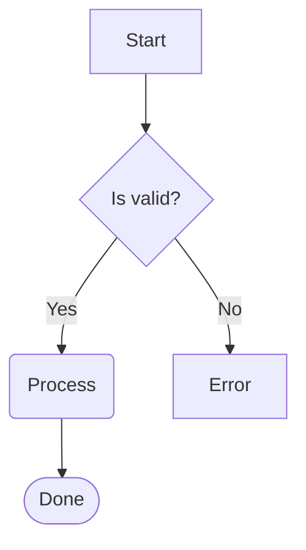

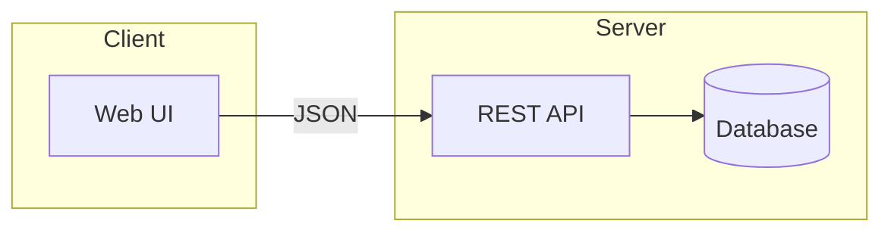

## Sequence diagram

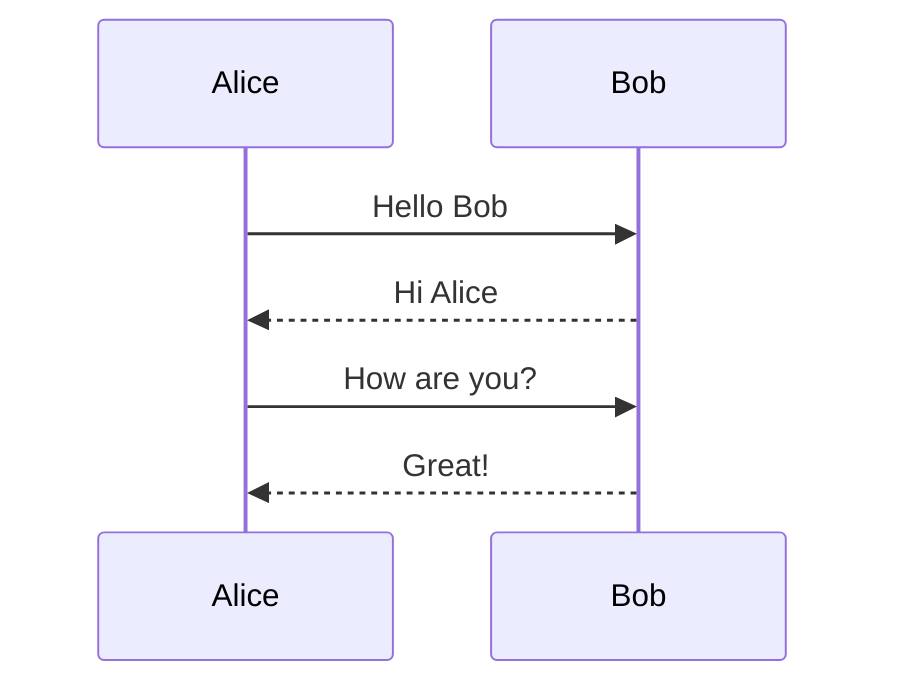

## Class diagram

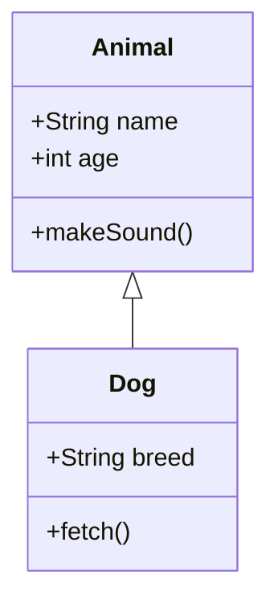

## Entity-relationship diagram

Logical / physical model with attributes, keys, and crow's-foot notation:

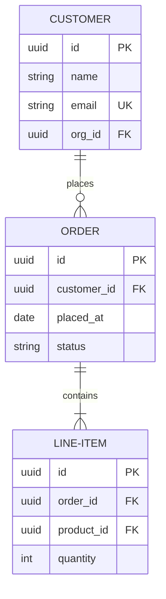

## Conceptual model

Chen-style view: entities as boxes, named relationships as diamonds. Omit attributes on an `erDiagram` and Summit treats it as conceptual.

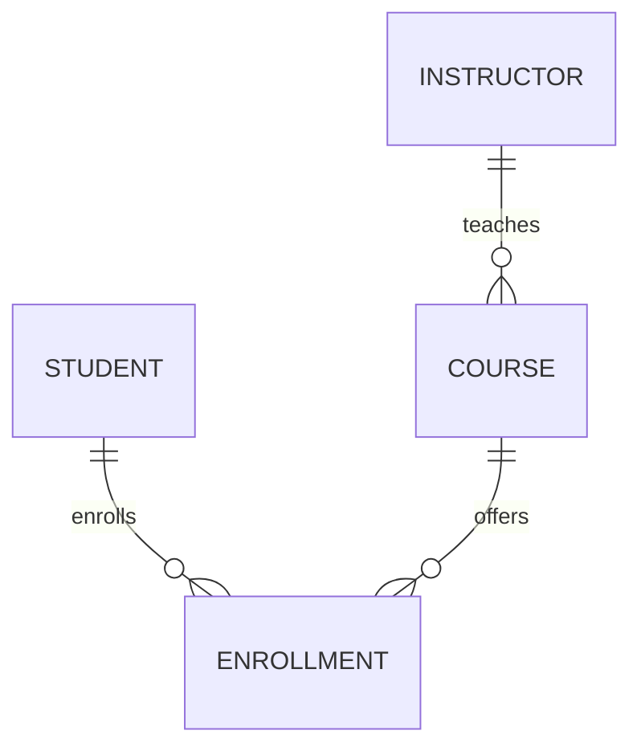

## State diagram

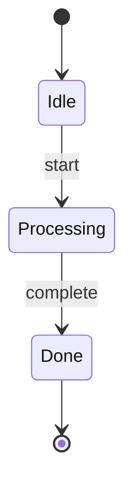

## Block diagram

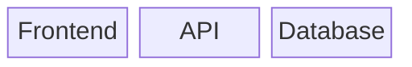

## Git graph

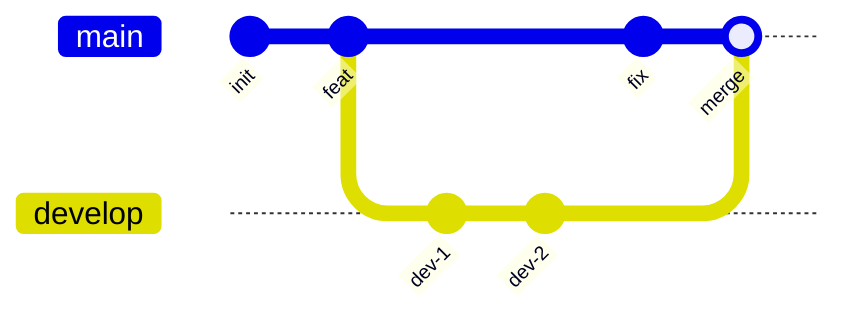

## Gantt chart

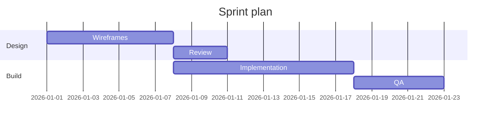

## Architecture diagram

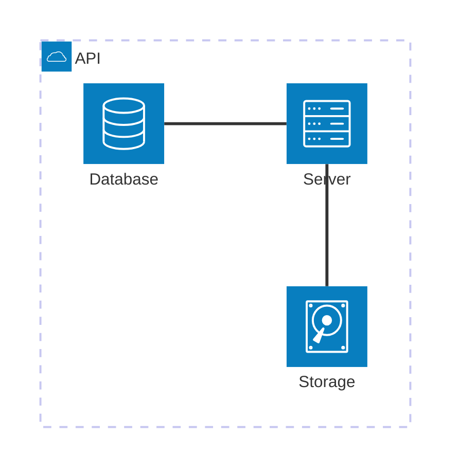

## Pie chart

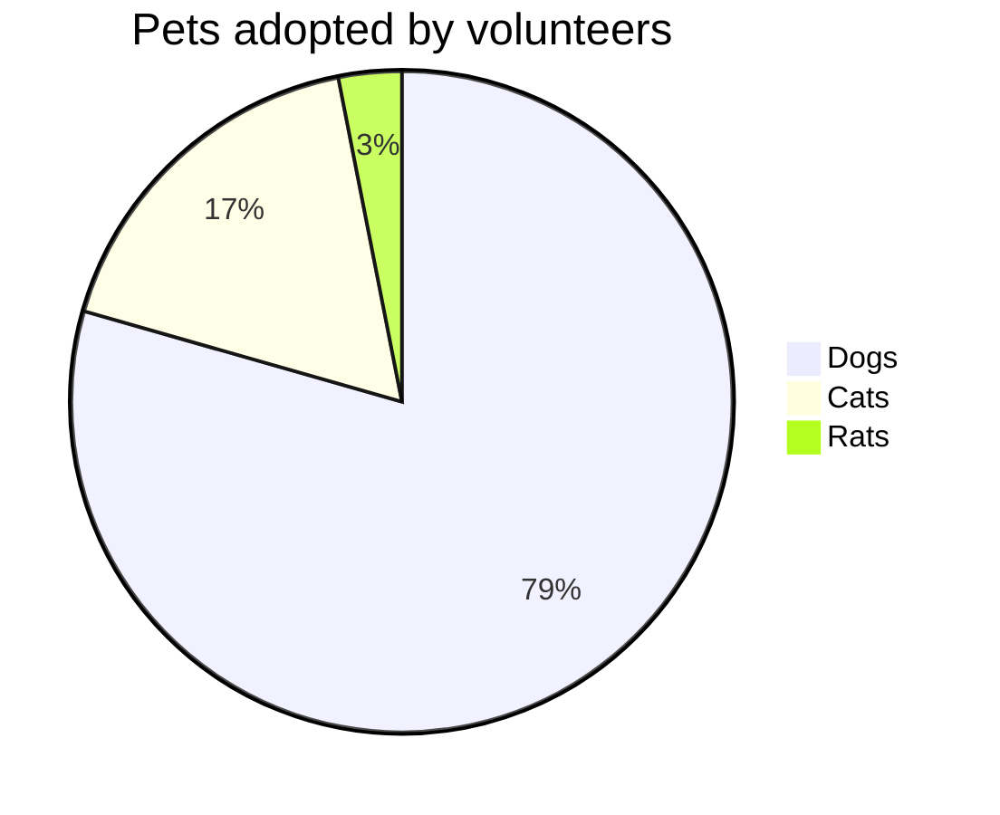

## Treemap

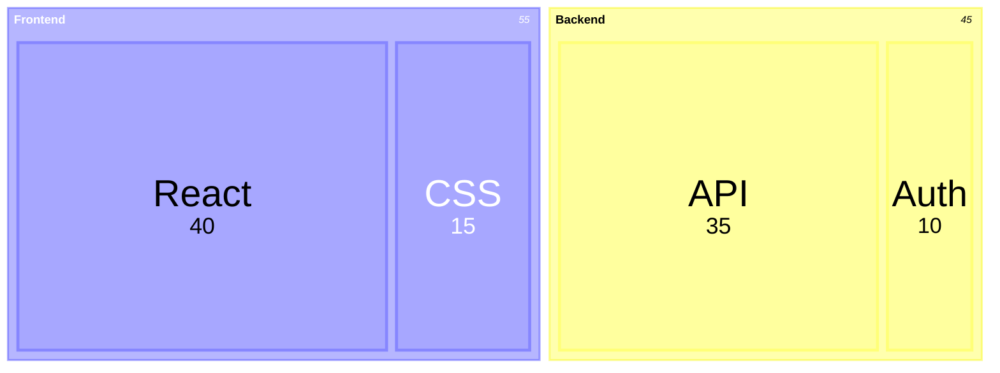

## Mindmap

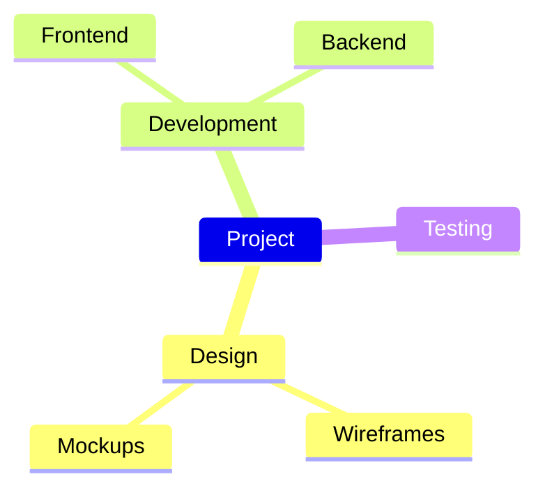

## Timeline

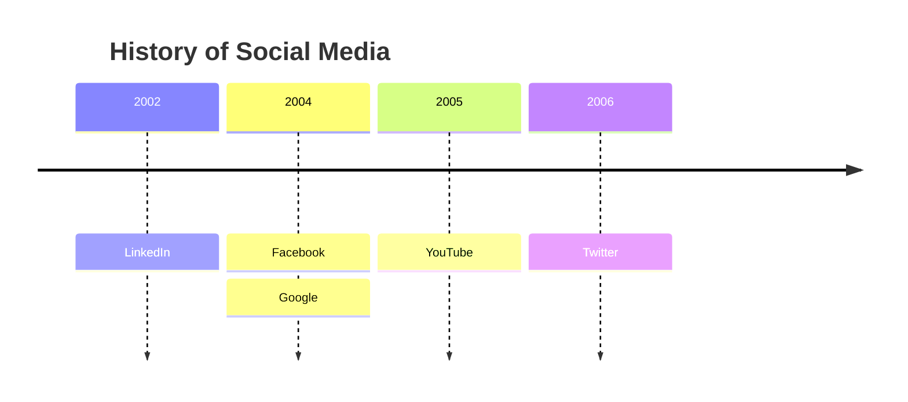

## Kanban

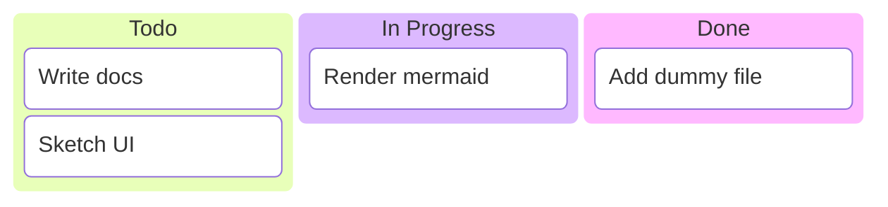

## Quadrant chart

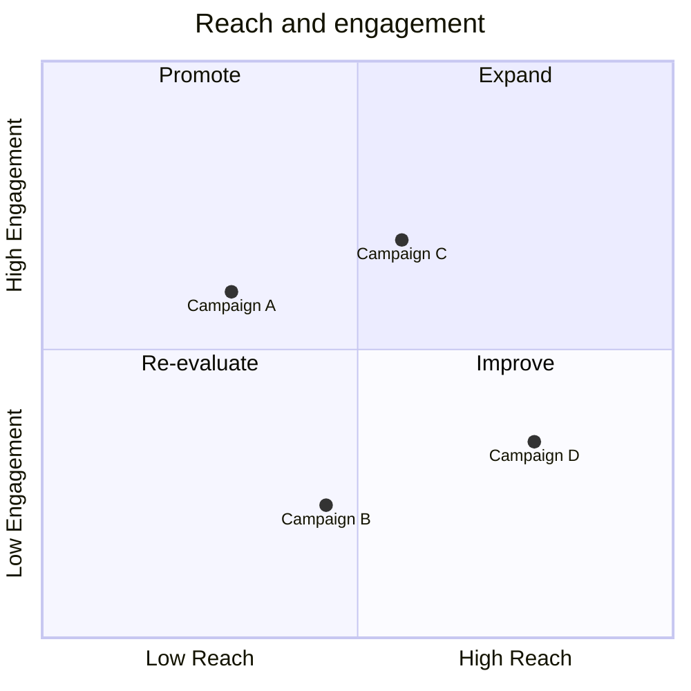

## XY chart

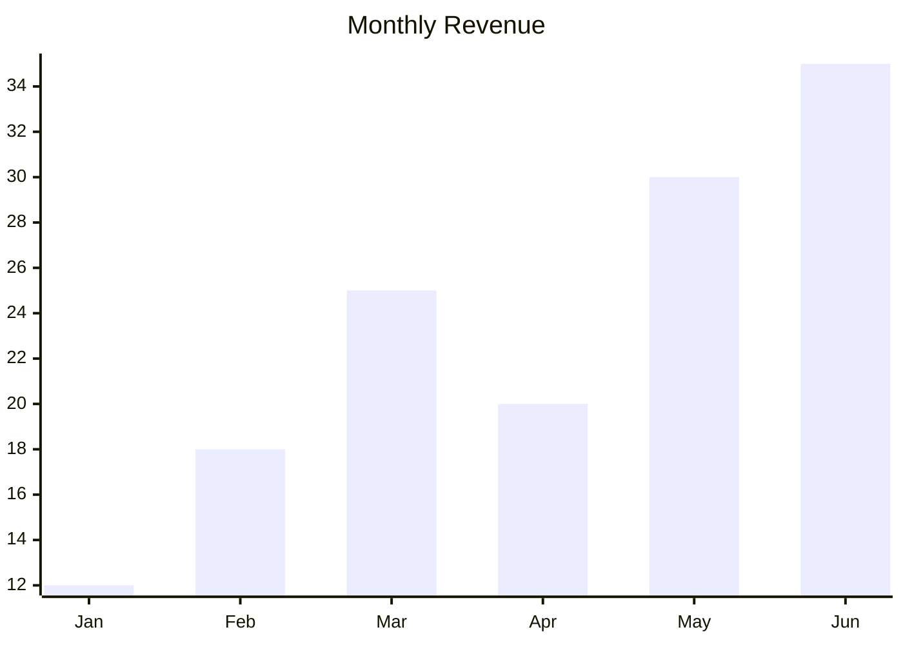

## User journey

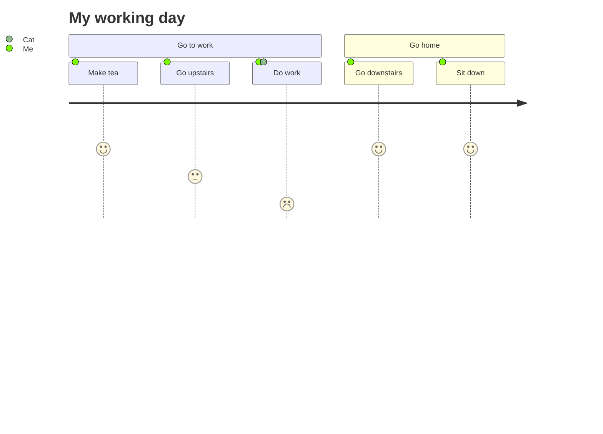

## Packet diagram

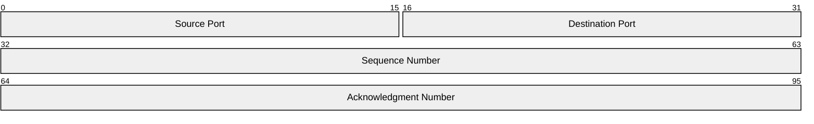

## Requirement diagram

```mermaid
requirementDiagram
    requirement test_req {
        id: 1
        text: the test must pass
        risk: high
        verifymethod: test
    }
    element test_ent {
        type: simulation
    }
    test_ent - satisfies -> test_req
```

## C4 context

```mermaid
C4Context
    title System Context
    Person(user, "User")
    System(summit, "Summit", "Markdown viewer")
    Rel(user, summit, "Reads docs")
```

## Sankey

```mermaid
sankey-beta
    Source,Target,Value
    A,B,10
    A,C,5
    B,D,8
    C,D,5
```

## Radar

```mermaid
radar-beta
    title Skills
    axis m["Mermaid"], t["Terminal"], p["Python"]
    curve a["Summit"]{80, 90, 70}
```
